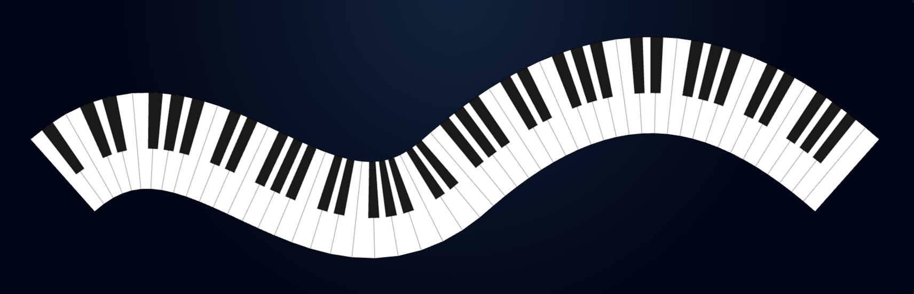

<p align="center">
  <a href="https://keystonescience.com" target="_blank" rel="noopener noreferrer">
    
  </a>
</p>

<p align="center">
  
</p>

# Piano Keys React Component

`curved-piano-keys` renders a full piano keyboard that hugs any SVG path. It started as a portfolio experiment and is now packaged for anyone to drop into their own projects.

## Features

- Map 88-key style keyboards (or any length) onto arbitrary SVG path data.
- Fine-grained control over ribbon thickness, black key geometry, and starting note.
- Optional viewBox fitting so the SVG crops itself to the rendered keys.
- Ships Bézier path presets to help you prototype layouts quickly.
- Interactive playground with a pen-style path builder, live prop controls, and a one-click copyable component snippet.

## Installation

```bash
npm install curved-piano-keys
```

> The package expects `react@^18` as a peer dependency.

## Usage

```tsx
import { CurvedPianoKeys, PIANO_PATH_PRESETS } from "curved-piano-keys";

export function Hero() {
  return (
    <CurvedPianoKeys
      d={PIANO_PATH_PRESETS[0].d}
      numWhiteKeys={52}
      thickness={84}
      startOn="A"
      showPath
    />
  );
}
```

### Key props

| Prop | Type | Default | Description |
| --- | --- | --- | --- |
| `d` | `string` | **required** | SVG path data to follow (e.g. `"M 40 240 C ..."`). |
| `numWhiteKeys` | `number` | `52` | Total white keys rendered along the path. |
| `thickness` | `number` | `80` | Ribbon thickness in px measured normal to the path. |
| `whiteKeySpan` | `number` | `undefined` | Override the calculated span if you need fixed key widths. |
| `startOn` | `'A' \\| 'C'` | `'A'` | Controls the black-key cadence, matching a real keyboard (`'A'`) or visually centred (`'C'`). |
| `blackWidthRatio` | `number` | `0.62` | Black-key width as a fraction of white-key span. |
| `blackDepth` | `number` | `0.64` | Black-key depth as a fraction of thickness. |
| `orientation` | `1 \| -1` | `1` | Flip to `-1` to draw the keyboard “below” the guide path. |
| `showPath` | `boolean` | `false` | Renders the source path dashed for quick debugging. |
| `fitViewBox` | `boolean` | `true` | Auto-fit the generated geometry inside the SVG viewBox. |
| `className` | `string` | `undefined` | Pass through a class for sizing or theming the `<svg>`. |

All props are optional except `d`. Full JSDoc lives in [`src/CurvedPianoKeys.tsx`](src/CurvedPianoKeys.tsx).

> The geometry is calculated with DOM APIs, so the component must render in a browser environment (e.g. a Next.js Client Component).

### Custom curve example

```tsx
const ribbon = "M 40 240 C 240 120 420 360 640 220 S 980 300 1140 200";

export function HeroBanner() {
  return (
    <CurvedPianoKeys
      d={ribbon}
      thickness={96}
      numWhiteKeys={60}
      startOn="C"
      orientation={-1}
      blackWidthRatio={0.58}
      blackDepth={0.66}
      showPath
      className="w-full max-w-5xl"
    />
  );
}
```

### Path presets

```ts
import { PIANO_PATH_PRESETS } from "curved-piano-keys/path-presets";
```

Each preset includes `id`, `name`, `description`, and the `d` attribute for quick demos.

## Interactive Playground

The repo ships with a Vite-powered playground featuring live prop controls, a smooth pen-style path builder, and a ready-to-copy component snippet. Run it locally:

```bash
npm install
npm install --prefix examples/playground
npm run demo:dev
```


Live playground: https://keystonescience.github.io/curved-piano-keys/

## Development

```bash
npm install
npm run build          # build the library
npm run demo:build     # builds the playground into examples/playground/dist
npm run build
```

The build uses `tsup` to output both CJS and ESM bundles in `dist/`.

## License

MIT © Nate Stone
